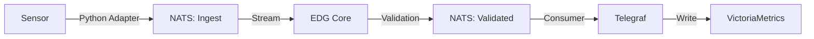

# EDG Platform

> **Industrial Edge Data Gateway**
> 
> High-performance data ingestion, validation, and storage platform for IIoT.

## Why EDG?

*   **Lightweight & Fast**: Built with Go and NATS for ultra-low latency.
*   **Reliable**: Built-in data validation and auto-registration of assets.
*   **Plug & Play**: Simple Python adapters for reading any sensor data.
*   **Time-Series Ready**: Seamless integration with VictoriaMetrics/InfluxDB via Telegraf.

## Key Features

*   **Automatic Asset Registration**: Device discovery and metadata registration without manual configuration.
*   **Data Validation**: Enforces schema and quality checks at the edge before data enters your storage.
*   **At-Least-Once Delivery**: Uses NATS JetStream to ensure zero data loss even during network outages.
*   **Flexible Adapters**: Easily write collectors in Python for Modbus, OPC-UA, or custom protocols.

## Quick Start

### 1. Installation
Download the latest release and run the installer:

```bash
# Linux / macOS
sudo ./install.sh
```

### 2. Start Services
```bash
sudo systemctl start edg-core
sudo systemctl start edg-telegraf
```

### 3. Send Data
Use the Python SDK to send your first metric:

```python
import asyncio, json
import nats

async def main():
    nc = await nats.connect("nats://localhost:4222")
    
    # Send sensor data
    data = {
        "asset_id": "sensor-001",
        "values": [
            {"name": "temperature", "number": 25.5, "unit": "°C", "quality": "good"}
        ]
    }
    
    await nc.publish("platform.data.asset", json.dumps(data).encode())
    print("Data sent!")
    await nc.close()

asyncio.run(main())
```

## Architecture



## Integrations

### Data Inputs
*   **Python SDK**: Custom adapters for any sensor.
*   **Standard Protocols**: Modbus, MQTT (Planned).

### Storage & Outputs
*   **VictoriaMetrics**: High-performance time-series storage (Recommended).
*   **InfluxDB**: v2 API compatible.
*   **NATS**: Raw stream access for other microservices.

## Roadmap

We are evolving from a data collector to a full **Bidirectional IoT Gateway**.

*   **Phase 1: Basic Control (Current)**
    *   Simple 1:1 Command/Response pattern.
    *   Secure execution of device commands via adapters.
*   **Phase 2: Advanced Logic (Planned)**
    *   Relationship-based control (Ontology).
    *   Automated sequences and conditional triggers.

## Documentation

*   **[User Guide](docs/USER_GUIDE.md)**: Detailed installation, configuration, and monitoring.
*   **[Developer Guide](docs/DEVELOPMENT.md)**: Building from source, contributing, and architecture details.

## LICENSE

Apache License 2.0. See [LICENSE](LICENSE) for details.
