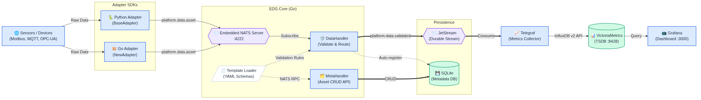
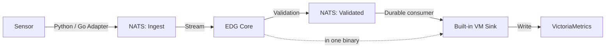

# EDG Platform


<div align="center">

</div>

> **Industrial Edge Data Gateway**
> 
> Low-overhead, high-performance edge gateway for industrial data ingestion, validation, and storage.

> [!WARNING]
> EDG is in early development and is not yet production-ready.
> APIs, configuration, and deployment workflows may change without notice.

## Why EDG?

*   **Lightweight & Fast**: Single Go binary, embedded NATS, SQLite metadata. No external services required to run a node.
*   **Explicit Reliability Boundary**: At-least-once delivery starts at the JetStream publish ack — operators know exactly where adapter retry or buffering is still needed. See [ADR 0001](docs/adr/0001-data-plane-reliability.md).
*   **Semantic Asset Model**: First-class asset relations (`partOf`, `connectedTo`, `locatedIn`) and external identifiers (`irdi`, `eclass`, `aas`, `opcua_node_id`) — a foundation for digital twin work, not just point collection.
*   **Wire-Contract First**: The integration contract is a small set of NATS subjects, not an SDK. Any language with a NATS client can publish data and subscribe to metadata events — Python and Go SDKs are conveniences for the common cases.
*   **Time-Series Ready**: A built-in durable sink writes validated data straight to VictoriaMetrics (or any InfluxDB line-protocol endpoint) — no separate metrics agent. The validated stream is also available on NATS for any other consumer.

## Key Features

*   **Automatic Asset Registration**: Devices appear in the metadata store the first time they publish data — no manual provisioning step.
*   **Metadata Change Events**: Asset and relation mutations are published on `platform.meta.*.changed` with `before` / `after` snapshots for reactive adapters and sidecars. See [Metadata Events](docs/events.md).
*   **Relationship-Aware Enrichment**: Validated data can carry ancestor tags derived from asset relations for line, area, and factory-level queries.
*   **Edge-Side Data Validation**: Template-driven schema and quality checks applied before data reaches storage.
*   **Dead-Letter Visibility**: Validated-publish failures are routed to `platform.data.deadletter` with expvar counters for monitoring.
*   **Multi-Language Adapters**: Python SDK, Go SDK, or direct NATS publishing — pick the language that matches your protocol library.

## Quick Start

### 1. Installation
Download the latest release and run the installer:

```bash
# Linux / macOS
sudo ./install.sh
```

### 2. Start Services
```bash
sudo systemctl start edg-victoriametrics
sudo systemctl start edg-core
```

EDG Core writes validated data to VictoriaMetrics through its built-in sink.
Inspect it at `http://localhost:8428/vmui` — no extra service required. If you
are using docker-compose, you can also start Grafana (optional) with
`docker compose --profile grafana up` for richer dashboards.

### 3. Send Data
Pick the SDK that fits your toolchain — both publish to the same NATS subject.

<details open>
<summary>Python</summary>

```python
import asyncio, json
import nats

async def main():
    nc = await nats.connect("nats://localhost:4222")

    data = {
        "asset_id": "sensor-001",
        "values": [
            {"name": "temperature", "number": 25.5, "unit": "°C", "quality": "good"}
        ]
    }

    await nc.publish("platform.data.asset", json.dumps(data).encode())
    print("Data sent!")
    await nc.close()

asyncio.run(main())
```

See [`adapters/python/sdk`](adapters/python/sdk) for the full SDK with adapter base class and reconnection.

</details>

<details>
<summary>Go</summary>

```go
package main

import (
    "context"
    "log"
    "os/signal"
    "syscall"
    "time"

    "github.com/e7217/edg/adapters/go/sdk"
)

type tempSensor struct{}

func (tempSensor) Collect(_ context.Context) ([]sdk.TagValue, error) {
    n := 25.5
    return []sdk.TagValue{
        {Name: "temperature", Quality: sdk.QualityGood, Number: &n, Unit: "°C"},
    }, nil
}

func main() {
    ctx, stop := signal.NotifyContext(context.Background(), syscall.SIGINT, syscall.SIGTERM)
    defer stop()

    a := sdk.NewAdapter(sdk.AdapterConfig{
        AssetID:         "sensor-001",
        CollectInterval: time.Second,
    }, tempSensor{})

    if err := a.Run(ctx); err != nil {
        log.Fatalf("adapter exited: %v", err)
    }
}
```

See [`adapters/go/sdk`](adapters/go/sdk) for the full SDK and runnable examples.

</details>

## Architecture



<details>
<summary>Mermaid</summary>


```mermaid
graph LR
    Sensor[Sensor] -->|Python / Go Adapter| NATS1[NATS: Ingest]
    NATS1 -->|Stream| Core[EDG Core]
    Core -->|Validation| NATS2[NATS: Validated]
    NATS2 -->|Durable consumer| Sink[Built-in VM Sink]
    Sink -->|Write| VM[VictoriaMetrics]
    Core -.->|in one binary| Sink
```

</details>

## Integrations

### Data Inputs
*   **[Python SDK](adapters/python/sdk)**: For Python-friendly protocols (Modbus via `pymodbus`, BACnet via `BACpypes`, EtherNet/IP via `pycomm3`, and others).
*   **[Go SDK](adapters/go/sdk)**: Same surface as the Python SDK. Good fit for Go-native protocol libraries and single-binary deployments.
*   **Any NATS client**: Adapters can publish to the NATS subjects directly without an EDG SDK. Useful for wrapping vendor C/C++ libraries (e.g. `opendnp3`, `lib60870`) as sidecars, or for niche languages.
*   **Standard Protocols**: Modbus TCP — reference adapters in [Python](adapters/python/examples/modbus_tcp) and [Go](adapters/go/sdk/examples/modbus_tcp_sensor). Modbus RTU, MQTT (Planned).

### Storage & Outputs
*   **VictoriaMetrics**: High-performance time-series storage (Recommended). Written to by core's built-in sink; query and explore cardinality via its built-in vmui at `:8428/vmui`.
*   **InfluxDB line protocol**: The sink endpoint is configurable (`sink.url` / `EDG_SINK_URL`), so any InfluxDB-compatible target works.
*   **NATS**: Raw stream access for other microservices — `platform.data.validated` stays published even when the sink is disabled.

## Roadmap

We are evolving from a data collector to a full **Bidirectional IoT Gateway**.

*   **Phase 1: Basic Control (Current)**
    *   Simple 1:1 Command/Response pattern.
    *   Secure execution of device commands via adapters.
*   **Phase 2: Advanced Logic (Planned)**
    *   Relationship-based control (Ontology) - design in [ADR 0003](docs/adr/0003-relationship-based-control.md).
    *   Automated sequences and conditional triggers - design in [ADR 0003](docs/adr/0003-relationship-based-control.md).

## Documentation

*   **[User Guide](docs/USER_GUIDE.md)**: Detailed installation, configuration, and monitoring.
*   **[Developer Guide](docs/DEVELOPMENT.md)**: Building from source, contributing, and architecture details.
*   **[Architecture Decisions](docs/adr/README.md)**: Runtime and reliability decisions.

## Grafana (Optional)

For day-to-day inspection you don't need Grafana — VictoriaMetrics ships a
built-in UI (vmui) at `http://localhost:8428/vmui` with ad-hoc queries and a
cardinality explorer, and no extra process.

Grafana is a central, optional layer for richer dashboards and alerting. It is
not in the systemd release bundle. With docker-compose it sits behind a profile:

```bash
docker compose --profile grafana up
```

- URL: http://localhost:3000
- Default user: `${GRAFANA_ADMIN_USER:-admin}`
- Default password: `${GRAFANA_ADMIN_PASSWORD:-admin}`

## LICENSE

Apache License 2.0. See [LICENSE](LICENSE) for details.
