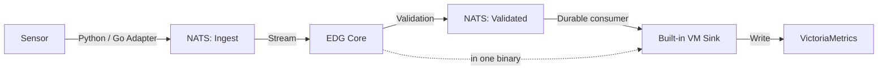

# EDG Platform


<div align="center">

</div>

> **Industrial Edge Data Gateway**
> 
> Low-overhead edge gateway for industrial data ingestion, validation, and storage.

> [!WARNING]
> EDG is in early development and is not yet production-ready.
> APIs, configuration, and deployment workflows may change without notice.

## Why EDG?

*   **Lightweight, and measured**: Single Go binary, embedded NATS, SQLite metadata. No external services required to run a node. On an 8-vCPU box shared with VictoriaMetrics and the load generator, one node sustained **200,000 points/s (4,000 messages/s) with p99 20 ms and nothing lost** — see the [capacity baseline](docs/perf/capacity-baseline.md) for the curve, the ceiling and what happens past it.
*   **Explicit Reliability Boundary**: At-least-once delivery starts at the JetStream publish ack — operators know exactly where adapter retry or buffering is still needed. See [ADR 0001](docs/adr/0001-data-plane-reliability.md).
*   **Adapter Visibility**: Adapters report runtime status automatically, so operators can see which are online, stale or degraded — and whether two are collecting the same asset. See [ADR 0008](docs/adr/0008-adapter-runtime-status.md).
*   **Role-Based Authorization**: The NATS subject contract is enforced, not just documented. Adapters publish telemetry and read master data but cannot mutate it; only core can publish `platform.data.validated`. See [ADR 0007](docs/adr/0007-nats-subject-authorization.md).
*   **Semantic Asset Model**: First-class asset relations (`partOf`, `connectedTo`, `locatedIn`) and external identifiers (`irdi`, `eclass`, `aas`, `opcua_node_id`) — a foundation for digital twin work, not just point collection.
*   **Wire-Contract First**: The integration contract is a small set of NATS subjects, not an SDK. Any language with a NATS client can publish data and subscribe to metadata events — Python and Go SDKs are conveniences for the common cases.
*   **Time-Series Ready**: A built-in durable sink writes validated data straight to VictoriaMetrics (or any InfluxDB line-protocol endpoint) — numbers, flags and text states alike, no separate metrics agent. The validated stream is also available on NATS for any other consumer.

## Key Features

*   **Explicit Master Data**: Assets are declared through the HTTP write API, the operator UI, or template import — never as a side effect of a device publishing. Telemetry for an undeclared asset follows `unknown_asset_policy` (`pass_through` or `dead_letter`) and is counted in `edg_core_undeclared_assets`.
*   **Metadata Change Events**: Asset and relation mutations are published on `platform.meta.*.changed` with `before` / `after` snapshots for reactive adapters and sidecars. See [Metadata Events](docs/events.md).
*   **Relationship-Aware Enrichment**: Validated data can carry ancestor tags derived from asset relations for line, area, and factory-level queries.
*   **Data Contract**: A message reaches `platform.data.validated` only if it is well-formed and agrees with master data — declared value types and units, master data over adapter metadata. What fails is removed at the smallest scope (message, value, key), counted by reason and dead-lettered with the original payload. See [ADR 0010](docs/adr/0010-data-contract.md).
*   **Dead-Letter Visibility**: Contract violations, undeclared assets (under `dead_letter` policy) and validated-publish failures are routed to `platform.data.deadletter` with the original payload and the reason, and counted on `/metrics`.
*   **Multi-Language Adapters**: Python SDK, Go SDK, or direct NATS publishing — pick the language that matches your protocol library. Reference adapters for Modbus TCP and RTU, OPC UA and MELSEC MC take their register maps from master data and follow changes to them ([ADR 0011](docs/adr/0011-point-distribution.md)).
*   **Bulk Provisioning and Backup**: A whole plant — templates, assets, relations and every point — exports as CSVs an operator edits in a spreadsheet and imports back, with `-dry-run` first. See [Plant Bundles](docs/USER_GUIDE.md#plant-bundles).

## Quick Start

### 1. Installation
Download the latest release and run the installer:

```bash
# Linux / macOS
sudo ./install.sh
```

### 2. Start Services
```bash
sudo systemctl start edg-victoriametrics
sudo systemctl start edg-core
```

EDG Core writes validated data to VictoriaMetrics through its built-in sink.
Inspect it at `http://localhost:8428/vmui` — no extra service required. If you
are using docker-compose, you can also start Grafana (optional) with
`docker compose --profile grafana up` for richer dashboards.

### 3. Send Data
Pick the SDK that fits your toolchain — both publish to the same NATS subject.

<details open>
<summary>Python</summary>

```python
import asyncio, json
import nats

async def main():
    nc = await nats.connect("nats://localhost:4222")

    data = {
        "asset_id": "sensor-001",
        "values": [
            {"name": "temperature", "number": 25.5, "unit": "°C", "quality": "good"}
        ]
    }

    await nc.publish("platform.data.asset", json.dumps(data).encode())
    print("Data sent!")
    await nc.close()

asyncio.run(main())
```

See [`adapters/python/sdk`](adapters/python/sdk) for the full SDK with adapter base class and reconnection.

</details>

<details>
<summary>Go</summary>

```go
package main

import (
    "context"
    "log"
    "os/signal"
    "syscall"
    "time"

    "github.com/e7217/edg/adapters/go/sdk"
)

type tempSensor struct{}

func (tempSensor) Collect(_ context.Context) ([]sdk.TagValue, error) {
    n := 25.5
    return []sdk.TagValue{
        {Name: "temperature", Quality: sdk.QualityGood, Number: &n, Unit: "°C"},
    }, nil
}

func main() {
    ctx, stop := signal.NotifyContext(context.Background(), syscall.SIGINT, syscall.SIGTERM)
    defer stop()

    a := sdk.NewAdapter(sdk.AdapterConfig{
        AssetID:         "sensor-001",
        CollectInterval: time.Second,
    }, tempSensor{})

    if err := a.Run(ctx); err != nil {
        log.Fatalf("adapter exited: %v", err)
    }
}
```

See [`adapters/go/sdk`](adapters/go/sdk) for the full SDK and runnable examples.

</details>

## Architecture


<details>
<summary>Mermaid</summary>


```mermaid
graph LR
    Sensor[Sensor] -->|Python / Go Adapter| NATS1[NATS: Ingest]
    NATS1 -->|Stream| Core[EDG Core]
    Core -->|Validation| NATS2[NATS: Validated]
    NATS2 -->|Durable consumer| Sink[Built-in VM Sink]
    Sink -->|Write| VM[VictoriaMetrics]
    Core -.->|in one binary| Sink
```

</details>

## Integrations

### Data Inputs
*   **[Python SDK](adapters/python/sdk)**: For Python-friendly protocols (Modbus via `pymodbus`, BACnet via `BACpypes`, EtherNet/IP via `pycomm3`, and others).
*   **[Go SDK](adapters/go/sdk)**: Same surface as the Python SDK. Good fit for Go-native protocol libraries and single-binary deployments.
*   **Any NATS client**: Adapters can publish to the NATS subjects directly without an EDG SDK. Useful for wrapping vendor C/C++ libraries (e.g. `opendnp3`, `lib60870`) as sidecars, or for niche languages. Credentials ride in the URL (`nats://adapter:<secret>@host:4222`), so no SDK is needed to authenticate either.
*   **Standard Protocols**: Modbus TCP — reference adapters in [Python](adapters/python/examples/modbus_tcp) and [Go](adapters/go/sdk/examples/modbus_tcp_sensor). Modbus RTU, MQTT (Planned).

### Storage & Outputs
*   **VictoriaMetrics**: High-performance time-series storage (Recommended). Written to by core's built-in sink; query and explore cardinality via its built-in vmui at `:8428/vmui`.
*   **InfluxDB line protocol**: The sink endpoint is configurable (`sink.url` / `EDG_SINK_URL`), so any InfluxDB-compatible target works.
*   **NATS**: Raw stream access for other microservices — `platform.data.validated` stays published even when the sink is disabled. Attach a durable consumer with the `fanout` role, which is scoped to that stream and nothing else.

## Roadmap

We are evolving from a data collector to a full **Bidirectional IoT Gateway**. What the gateway guarantees today, and what it costs, are measured rather than claimed: the [data contract](docs/adr/0010-data-contract.md), the [storage end-to-end test](scripts/e2e-storage.sh) and the [capacity baseline](docs/perf/capacity-baseline.md).

*   **Point provisioning (shipped)**
    *   The plant's tag inventory is master data: which address on a device maps to which tag name, type and unit, declared per asset and editable in one place. See [Point Provisioning](docs/USER_GUIDE.md#point-provisioning).
    *   Adapters take their point list from it and rebuild when it changes, and `/api/v1/adapters/drift` reports any that are running an older version ([ADR 0011](docs/adr/0011-point-distribution.md)).
    *   A whole plant moves as a directory of CSVs an operator can edit in a spreadsheet: [Plant Bundles](docs/USER_GUIDE.md#plant-bundles).
*   **Protocols (shipped, reference adapters)**
    *   Modbus TCP and RTU, OPC UA, MELSEC MC — each reads its points from master data. See the [adapter guide](docs/ADAPTER_GUIDE.md). None has been run against physical hardware yet.
*   **Basic control (not implemented)**
    *   Simple 1:1 command/response, and secure execution of device commands via adapters.
    *   Nothing of this exists in the code yet. Neither SDK can receive a command: a collector's only method is `Collect`. This entry said "Current" for a long time and was wrong.
*   **Advanced logic (designed, not implemented)**
    *   Relationship-based control over the ontology - design in [ADR 0003](docs/adr/0003-relationship-based-control.md).
    *   Automated sequences and conditional triggers - design in [ADR 0004](docs/adr/0004-ontology-rule-engine.md).

## Documentation

*   **[User Guide](docs/USER_GUIDE.md)**: Detailed installation, configuration, and monitoring.
*   **[Developer Guide](docs/DEVELOPMENT.md)**: Building from source, contributing, and architecture details.
*   **[Architecture Decisions](docs/adr/README.md)**: Runtime and reliability decisions.

## Grafana (Optional)

For day-to-day inspection you don't need Grafana — VictoriaMetrics ships a
built-in UI (vmui) at `http://localhost:8428/vmui` with ad-hoc queries and a
cardinality explorer, and no extra process.

Grafana is a central, optional layer for richer dashboards and alerting. It is
not in the systemd release bundle. With docker-compose it sits behind a profile:

```bash
docker compose --profile grafana up
```

- URL: http://localhost:3000
- Default user: `${GRAFANA_ADMIN_USER:-admin}`
- Default password: `${GRAFANA_ADMIN_PASSWORD:-admin}`

## LICENSE

Apache License 2.0. See [LICENSE](LICENSE) for details.
