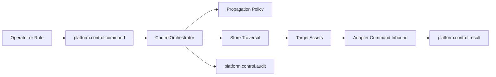
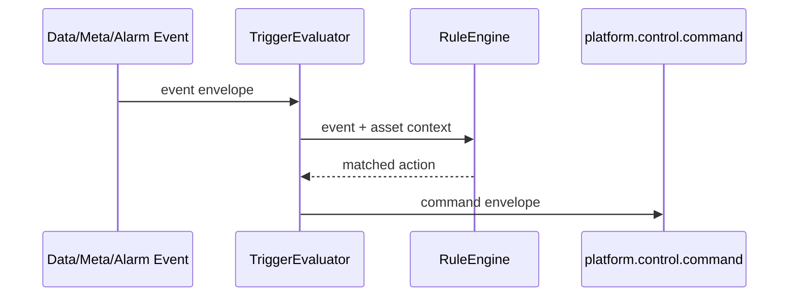

# ADR 0003: Relationship-Based Control and Conditional Triggers

## Status

Accepted

## Context

EDG's roadmap calls for basic command/response control, relationship-based
control, and automated conditional triggers. The current codebase does not yet
implement a `platform.control.*` subject family or adapter-side command inbound
surface. Existing runtime surfaces are the data plane (`platform.data.*`), the
metadata plane (`platform.meta.*`), alarm events (`platform.alarm.*`), and graph
traversal over asset relations.

The next control design must use the relation graph without making propagation
unsafe by default. Industrial control commands can change physical equipment
state, so the first implementation needs explicit propagation policy, audit
events, dry-run behavior, and loop guards before any command reaches adapters.

## Decision

EDG will introduce a separate control plane under `platform.control.*`. Control
commands are accepted by a future `ControlOrchestrator`, which expands the
target set through the relation graph only when asset or template policy allows
propagation.



The command envelope is:

```json
{
  "id": "cmd-001",
  "source": "operator",
  "source_asset_id": "line-3",
  "action": "stop",
  "mode": "confirm",
  "propagation": {
    "relation_types": ["partOf"],
    "max_depth": 3,
    "override_policy": false
  },
  "args": {
    "reason": "upstream fault"
  },
  "issued_at": "2026-05-20T00:00:00Z",
  "trace_id": "trace-001",
  "hop": 0,
  "visited_asset_ids": ["line-3"]
}
```

Control result and audit events use separate subjects:

| Subject | Meaning |
|---|---|
| `platform.control.command` | Command request from an operator, API, or trigger. |
| `platform.control.result` | Per-target and aggregate command results. |
| `platform.control.audit` | Immutable audit event for accepted, rejected, dry-run, executed, failed, and rolled-back commands. |

The result envelope is:

```json
{
  "command_id": "cmd-001",
  "status": "partial_failure",
  "results": [
    {"asset_id": "pump-a", "status": "succeeded"},
    {"asset_id": "pump-b", "status": "failed", "error": "adapter timeout"}
  ],
  "completed_at": "2026-05-20T00:00:05Z"
}
```

The control safety modes are:

| Mode | Behavior |
|---|---|
| `dryrun` | Compute policy and affected assets, publish audit/result, do not send adapter commands. |
| `confirm` | Publish affected assets and require explicit approval before execution. |
| `execute` | Execute immediately after policy and authorization checks. |

The default mode is `dryrun`. Production deployments should allow `execute` only
for authenticated principals and explicitly approved actions.

Propagation is opt-in. Asset or template metadata must declare which actions can
propagate, which relation types are allowed, max depth, and whether rollback is
supported. A command can narrow policy for a single request but cannot broaden it
unless `override_policy` is authorized.

Conditional triggers are a separate catalog. They observe data, metadata,
alarms, and future control events, evaluate a condition, and publish a normal
`platform.control.command` when the condition matches.



The trigger catalog shape is:

```yaml
triggers:
  - name: stop-line-on-critical-pump-alarm
    enabled: true
    when: alarm.severity == "critical" && asset.template == "equipment"
    command:
      source_asset_id: "{{ asset.line.id }}"
      action: stop
      mode: confirm
      propagation:
        relation_types: [partOf]
        max_depth: 3
```

The rule expression language will be finalized by ADR 0004. Until then, the
control design treats rule evaluation as an interface:

```go
type RuleEngine interface {
    Eval(ctx EvalContext) ([]Action, error)
}

type EvalContext struct {
    Event any
    Asset *Asset
    Store *Store
}
```

All control messages carry `trace_id`, `hop`, and `visited_asset_ids`. The
orchestrator must fail closed when `hop` exceeds the configured limit or the next
target already appears in `visited_asset_ids`.

## Consequences

Control remains separated from metadata and data ingestion. Existing adapters
and consumers are unaffected until a later implementation adds command inbound
support to SDKs.

The first implementation can be split into smaller PRs:

| Follow-up | Scope |
|---|---|
| Control orchestrator | NATS command subscription, policy evaluation, traversal expansion, result aggregation. |
| Adapter command inbound | SDK subject naming, handler registration, timeout and acknowledgement behavior. |
| Trigger catalog | File-backed trigger definitions, hot reload, validation, and dry-run output. |
| Audit persistence | JetStream or SQLite-backed audit retention and query API. |
| Approval workflow | Confirm-mode pending command store and explicit approve/reject subjects or API. |

Rollback is best effort. The command policy must declare whether an action has a
known compensating action. If any target fails and rollback is supported, the
orchestrator attempts rollback for targets already applied and emits both result
and audit events.

Authentication and authorization are mandatory for `confirm` approvals and
`execute` commands. The initial mechanism should use NATS credentials and
subject permissions; stronger identity mapping can be added later.

## Validation

The design is considered ready for implementation when follow-up PRs include:

- Unit coverage for propagation policy, max depth, and cycle guards.
- Integration coverage for dry-run, confirm, execute, partial failure, and
  rollback audit paths.
- SDK tests proving adapters can register command handlers and return bounded
  acknowledgements.
- Trigger tests proving one incoming event creates at most one command unless a
  trigger explicitly allows fan-out.
