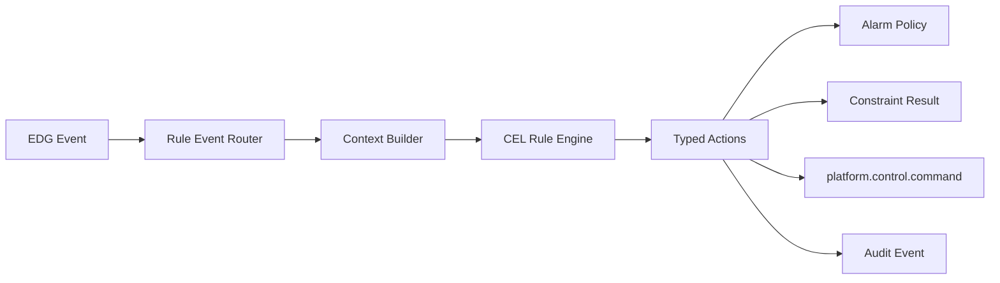

# ADR 0004: Ontology Rule Engine

## Status

Accepted

## Context

EDG now has several places where relationship-aware decisions are emerging:

- Alarm grouping and impact analysis needs policies for grouping, suppression,
  and escalation.
- Template constraints validate whether asset relations satisfy static
  structural rules.
- Relationship-based control and conditional triggers need a shared predicate
  layer before publishing control commands.

If each subsystem grows its own condition syntax and evaluation behavior, EDG
will fragment operator configuration, determinism, audit output, and testing.
The rule engine should provide a common predicate and action contract while
remaining small enough for edge deployments.

## Decision

EDG will introduce an embedded rule engine with CEL expressions for predicates
and typed EDG actions for effects. CEL is used only to evaluate deterministic
boolean or scalar expressions. It does not execute arbitrary code and does not
directly mutate EDG state.

| Candidate | Strengths | Weaknesses | Decision |
|---|---|---|---|
| CEL | Deterministic expression language, Go library, sandbox-friendly, readable for simple predicates. | Not a full production rule system; actions must be modeled separately. | Chosen for v1. |
| Rego / OPA | Mature policy ecosystem, strong data query model, good tooling. | Heavier runtime and steeper learning curve for edge operators. | Reconsider for enterprise policy bundles. |
| Custom DSL | Full control over syntax and semantics. | Long-term maintenance burden and poor interoperability. | Rejected for v1. |
| Lua or other scripting | Familiar imperative model. | Harder sandboxing and determinism; unsafe fit for industrial control. | Rejected. |

The rule engine interface is:

```go
type RuleEngine interface {
    Eval(ctx EvalContext) ([]Action, error)
    Validate(rule Rule) error
}

type EvalContext struct {
    Event EventEnvelope
    Asset *Asset
    Store TraversalReader
    Now   time.Time
    State RuleState
}

type TraversalReader interface {
    GetAncestors(assetID string, relTypes []RelationType, maxDepth int) ([]*AssetNode, error)
    GetDescendants(assetID string, relTypes []RelationType, maxDepth int) ([]*AssetNode, error)
    GetConnected(assetID string, relType RelationType) ([]*AssetNode, error)
}
```

Rules are file-backed YAML under a future `rules/` directory. Files are suitable
for GitOps and local review. Hot reload can be added after the first static load
implementation.

```yaml
rules:
  - name: stop-line-on-critical-pump-alarm
    enabled: true
    on:
      subjects: [platform.alarm.raised]
    when: event.alarm.severity == "critical" && asset.template == "equipment"
    then:
      - kind: control.command
        args:
          source_asset_id: asset.ancestor("line").id
          action: stop
          mode: confirm
          propagation:
            relation_types: [partOf]
            max_depth: 3
```

The rule schema separates trigger selection, predicate evaluation, and actions:

| Field | Meaning |
|---|---|
| `name` | Stable rule identifier used in audit output. |
| `enabled` | Allows rules to remain configured but inactive. |
| `on.subjects` | Event subjects that can invoke the rule. |
| `when` | CEL predicate. It must evaluate to `true` before actions run. |
| `then` | Typed EDG actions, validated before runtime. |

Typed actions are intentionally narrow:

| Action kind | Effect |
|---|---|
| `alarm.group` | Override or annotate alarm grouping policy. |
| `constraint.violation` | Emit a structural validation violation or warning. |
| `control.command` | Publish a command envelope described by ADR 0003. |
| `metadata.annotate` | Add a non-authoritative derived annotation in a future store. |
| `audit.event` | Emit an audit-only record for observability. |

The v1 evaluation context exposes these stable variables:

| Variable | Meaning |
|---|---|
| `event` | Normalized data, metadata, alarm, constraint, or control event. |
| `asset` | Current asset plus safe helper methods for ancestors, descendants, and connected assets. |
| `now` | Evaluation timestamp injected by the engine. |
| `state` | Bounded in-memory counters or windows; absent in the first implementation unless explicitly enabled. |

Rules must be deterministic. The engine will reject expressions that require
network, file, random, process, or wall-clock access outside the injected `now`.
Evaluation failures fail closed for control actions and surface as warnings for
non-control advisory actions.

The runtime flow is:



## Integration Hooks

The first implementation should keep existing subsystem defaults working when
no rules are loaded.

| Subsystem | Hook | Rule role |
|---|---|---|
| Alarm impact (#85) | `platform.alarm.raised` before grouping. | Select grouping window, grouping ancestor, suppression, or escalation action. |
| Template constraints (#86) | Asset or relation mutation validation. | Add dynamic validation rules after static template constraints pass. |
| Conditional triggers (#87) | Event router for data, metadata, alarm, and control events. | Turn matched predicates into `platform.control.command`. |

Example rules:

```yaml
rules:
  - name: group-critical-alarms-by-line
    enabled: true
    on: { subjects: [platform.alarm.raised] }
    when: event.alarm.severity == "critical" && asset.ancestor("line").exists()
    then:
      - kind: alarm.group
        args: { ancestor_template: line, window: 5s }

  - name: forbid-floating-production-sensors
    enabled: true
    on: { subjects: [platform.meta.asset.changed, platform.meta.relation.changed] }
    when: asset.template.endsWith("-sensor") && !asset.ancestor("equipment").exists()
    then:
      - kind: constraint.violation
        args: { severity: warning, message: sensor must be partOf equipment }

  - name: stop-line-on-critical-equipment-alarm
    enabled: true
    on: { subjects: [platform.alarm.raised] }
    when: event.alarm.severity == "critical" && asset.template == "equipment"
    then:
      - kind: control.command
        args:
          source_asset_id: asset.ancestor("line").id
          action: stop
          mode: confirm

  - name: suppress-maintenance-low-alarms
    enabled: true
    on: { subjects: [platform.alarm.raised] }
    when: asset.labels.exists(l, l == "maintenance") && event.alarm.severity == "info"
    then:
      - kind: alarm.group
        args: { suppress: true, reason: maintenance window }

  - name: audit-factory-wide-command
    enabled: true
    on: { subjects: [platform.control.command] }
    when: event.command.propagation.max_depth > 3
    then:
      - kind: audit.event
        args: { severity: warning, message: broad control propagation requested }
```

## Operational Model

Rules are loaded at startup from:

```yaml
rules:
  dir: ./rules
  enabled: true
  fail_on_invalid: true
  max_eval_ms: 5
  max_actions_per_rule: 5
```

The first implementation should default to `enabled: false` until the rule
engine has dry-run tooling. Invalid rules should fail startup only when
`fail_on_invalid` is true; otherwise they are disabled and reported.

Performance budgets:

| Budget | Target |
|---|---|
| Rule validation | Startup or reload only. |
| Single predicate evaluation | < 1 ms typical, hard timeout at `max_eval_ms`. |
| Actions per matched rule | Default maximum 5. |
| Traversal helper depth | Must respect caller-provided max depth and Store traversal limits. |
| Audit | Every matched rule emits rule name, input event ID, action kinds, duration, and outcome. |

## Consequences

CEL becomes the shared predicate language for alarms, constraints, and triggers,
but EDG avoids making CEL responsible for side effects. This keeps execution
deterministic and keeps control safety review focused on typed actions.

Static template constraints remain useful. They are simpler, easier to validate
at template load time, and should run before dynamic rules. Dynamic constraint
rules are for cross-asset or conditional cases that the static schema cannot
express.

The first rule engine PR should not replace existing alarm grouping or template
constraints. It should run in observe/dry-run mode first, emit audit output, and
only later become an enforcement path.

## Validation

Implementation PRs must include:

- Parser and validator tests for valid, disabled, malformed, and unknown-action
  rules.
- Determinism tests proving rejected functions cannot access time except through
  injected `now`.
- Evaluation tests for data, metadata, alarm, constraint, and control contexts.
- Performance tests for the configured timeout path.
- Integration tests showing rule matches can emit alarm, constraint, audit, and
  control actions without bypassing existing subsystem safety checks.
